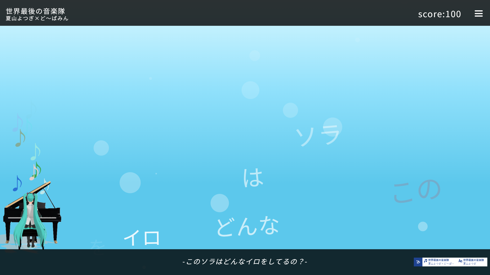

# 初音ミク「マジカルミライ 2026」プログラミング・コンテスト エントリー作品「ミクミク音楽隊」

    

## イントロダクション
ミクミク音楽隊は，**TextAlive App API**を用いたリリックアプリです．対象の受賞作品を再生して鑑賞できるほか，ゲームとしても遊ぶことが出来ます． 
この作品の制作意図としては，湖畔で優雅に演奏する初音ミクをイメージしています． 
ぜひ，ゲームで高得点を取れるか試してみてください！
## 遊び方
<li>起動後，クリックして好きな楽曲を選択してください．
<li>ローディング後，Playを押すと再生が始まります．
<li>文字をクリックしてスコアを獲得！
<li>楽曲再生完了後，最終スコアが確認できます．

## 動作環境
PCのみです．

## ビルド
ビルドツールは不要です．

## ポイント
<li>なるべくリリックアプリとして使えるように，下部に分かりやすい歌詞表示や，上部に曲名，作曲・作詞者の表記などを載せています． 
<li>楽曲は対象楽曲の6つすべてに対応しています．
<li>ゲームとしては歌詞がランダムに流れる仕様になっていて，たまに難しくなることもあるので，常に新鮮な感覚で楽しめると思います．

## クレジット
写真提供：浜松・浜名湖ツーリズムビューロー 
初音ミク：川口重工製初音ミクVer.2.00  made by かにかま 
"グランドピアノMMDモデル" (https://3d.nicovideo.jp/works/td78830) by Amatsukast, 時の番人 is licensed under CC Attribution-NonCommercial-ShareAlike (http://creativecommons.org/licenses/by-nc-sa/4.0/) 
License：CC4.0(BY-NC-SA) (http://creativecommons.org/licenses/by-nc-sa/4.0/) 